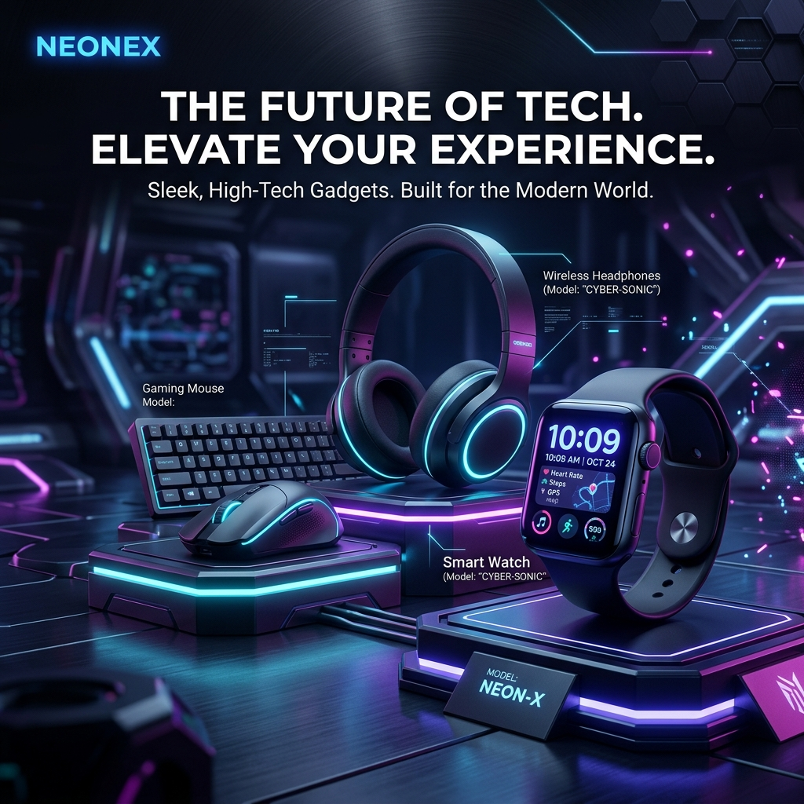
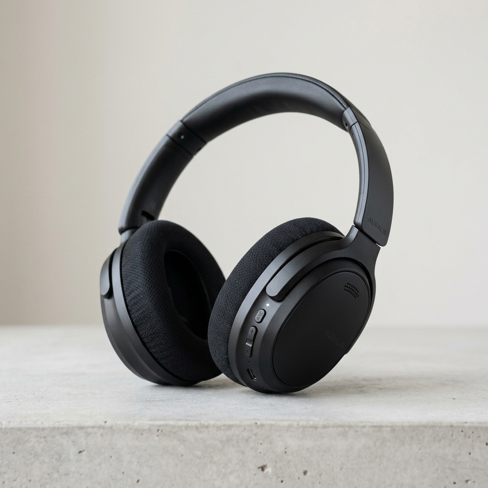
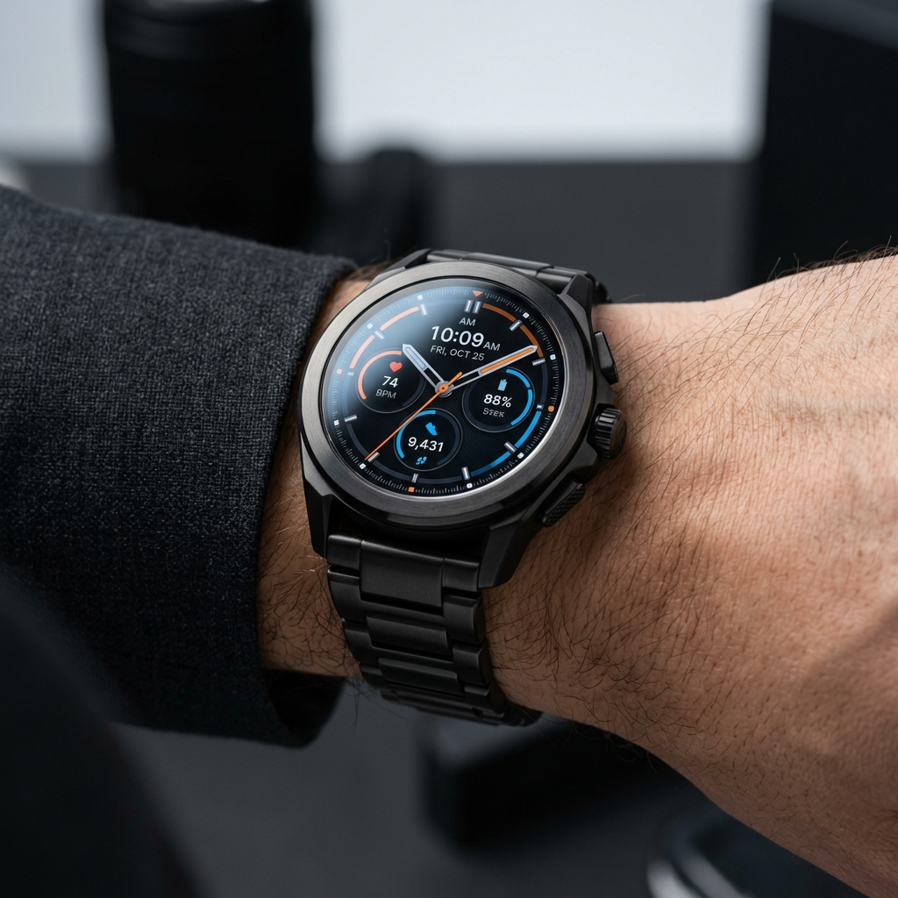

# Ex02 Commercial Website
**Date:** 07/08/2026

---

## AIM
To create a commercial website using CSS Flexbox.

---

## ALGORITHM

* **STEP 1**: Create an HTML file (`index.html`).
* **STEP 2**: Create a CSS file (`style.css`).
* **STEP 3**: Include a navigation bar with links to different sections.
* **STEP 4**: Add structured sections for Homepage, Products / Services, About Us, Contact Details and User Account.
* **STEP 5**: Include social media links at the footer with copyright information.
* **STEP 6**: Define global styles for fonts, colors, and layout.
* **STEP 7**: Style the header, navigation bar, and sections.
* **STEP 8**: Use Flexbox for layout design.
* **STEP 9**: Add hover effects and transitions for interactivity.
* **STEP 10**: Add Images and Media.
* **STEP 11**: Use optimized images for a professional look.
* **STEP 12**: Open the HTML file in a browser to check layout and functionality.
* **STEP 13**: Fix styling issues and refine content placement.
* **STEP 14**: Deploy the website.
* **STEP 15**: Upload to GitHub Pages for free hosting.

---

## PROGRAM

### `index.html`
```html
<!DOCTYPE html>
<html lang="en">
<head>
    <meta charset="UTF-8">
    <meta name="viewport" content="width=device-width, initial-scale=1.0">
    <title>NexTech Solutions — Premium Commercial Platform</title>
    <link rel="stylesheet" href="style.css">
    <!-- FontAwesome for icons -->
    <link rel="stylesheet" href="https://cdnjs.cloudflare.com/ajax/libs/font-awesome/6.4.0/css/all.min.css">
</head>
<body>

    <!-- Header & Navigation Bar (Flexbox) -->
    <header class="navbar-header">
        <div class="nav-container">
            <div class="logo">
                <i class="fa-solid me-2 fa-bolt logo-icon"></i> NexTech<span>Solutions</span>
            </div>
            
            <nav class="nav-links">
                <a href="#home" class="active">Home</a>
                <a href="#products">Products & Services</a>
                <a href="#about">About Us</a>
                <a href="#contact">Contact</a>
                <a href="#account">User Account</a>
            </nav>

            <div class="nav-actions">
                <div class="cart-btn">
                    <i class="fa-solid fa-cart-shopping"></i>
                    <span class="cart-count">3</span>
                </div>
                <a href="#account" class="btn btn-primary">Sign In</a>
            </div>
        </div>
    </header>

    <!-- Homepage Section (Flexbox Hero) -->
    <section id="home" class="hero-section">
        <div class="hero-container">
            <div class="hero-content">
                <span class="badge">Next-Gen Tech Commercial Store</span>
                <h1>Power Your Future with AI Hardware</h1>
                <p>Explore high-performance smart devices, workstation solutions, and enterprise AI accessories engineered for maximum efficiency.</p>
                <div class="hero-buttons">
                    <a href="#products" class="btn btn-primary btn-lg"><i class="fa-solid fa-bag-shopping"></i> Shop Products</a>
                    <a href="#about" class="btn btn-secondary btn-lg">Learn More</a>
                </div>
            </div>
            <div class="hero-image">
                
            </div>
        </div>
    </section>

    <!-- Products / Services Section (Flexbox Grid) -->
    <section id="products" class="products-section">
        <div class="section-title">
            <h2>Products & Services</h2>
            <p>Premium hardware devices and custom enterprise software services</p>
            <hr class="divider">
        </div>

        <div class="product-flex-container">
            <!-- Product Card 1 -->
            <div class="product-card">
                <div class="card-img-wrapper">
                    <span class="tag tag-featured">Top Seller</span>
                    
                </div>
                <div class="card-body">
                    <h3>NexAudio ANC Pro Wireless</h3>
                    <p class="description">Active noise-canceling headphones with 40-hour battery life and spatial AI sound processing.</p>
                    <div class="card-footer-flex">
                        <span class="price">$249.99</span>
                        <button class="btn btn-primary btn-sm"><i class="fa-solid fa-cart-plus"></i> Add to Cart</button>
                    </div>
                </div>
            </div>

            <!-- Product Card 2 -->
            <div class="product-card">
                <div class="card-img-wrapper">
                    <span class="tag tag-new">New Release</span>
                    
                </div>
                <div class="card-body">
                    <h3>NexChronos Smart AI Watch</h3>
                    <p class="description">Titanium body with real-time biometric monitoring, offline GPS, and voice AI assistant.</p>
                    <div class="card-footer-flex">
                        <span class="price">$329.99</span>
                        <button class="btn btn-primary btn-sm"><i class="fa-solid fa-cart-plus"></i> Add to Cart</button>
                    </div>
                </div>
            </div>

            <!-- Service Card 3 -->
            <div class="product-card service-card">
                <div class="service-icon">
                    <i class="fa-solid fa-cloud-bolt"></i>
                </div>
                <div class="card-body">
                    <h3>Enterprise Cloud Infrastructure</h3>
                    <p class="description">Custom cloud deployment, server scaling, and automated security monitoring for businesses.</p>
                    <div class="card-footer-flex">
                        <span class="price">From $499/mo</span>
                        <button class="btn btn-secondary btn-sm">Enquire Now</button>
                    </div>
                </div>
            </div>

            <!-- Service Card 4 -->
            <div class="product-card service-card">
                <div class="service-icon">
                    <i class="fa-solid fa-brain"></i>
                </div>
                <div class="card-body">
                    <h3>AI & ML Custom Integration</h3>
                    <p class="description">End-to-end integration of LLMs, RAG pipelines, and automated workflow agents into your app.</p>
                    <div class="card-footer-flex">
                        <span class="price">Custom Quote</span>
                        <button class="btn btn-secondary btn-sm">Consultation</button>
                    </div>
                </div>
            </div>
        </div>
    </section>

    <!-- About Us Section (Flexbox Layout) -->
    <section id="about" class="about-section">
        <div class="about-container">
            <div class="about-text">
                <h2>About NexTech Solutions</h2>
                <p>Founded in 2024, NexTech Solutions is a leading commercial technology provider specializing in next-generation hardware and enterprise AI services. We empower businesses and consumers with cutting-edge electronics and software solutions built for scalability and performance.</p>
                
                <div class="stats-flex">
                    <div class="stat-item">
                        <h4>100K+</h4>
                        <p>Products Shipped</p>
                    </div>
                    <div class="stat-item">
                        <h4>99.9%</h4>
                        <p>Service Uptime</p>
                    </div>
                    <div class="stat-item">
                        <h4>24/7</h4>
                        <p>Customer Support</p>
                    </div>
                </div>
            </div>
        </div>
    </section>

    <!-- User Account Section (Flexbox Form & Profile Card) -->
    <section id="account" class="account-section">
        <div class="section-title">
            <h2>User Account</h2>
            <p>Access your dashboard, manage orders, and update credentials</p>
            <hr class="divider">
        </div>

        <div class="account-flex-container">
            <!-- Sign In Card -->
            <div class="account-card">
                <h3><i class="fa-solid fa-user-lock"></i> Account Sign In</h3>
                <form class="account-form" onsubmit="event.preventDefault();">
                    <div class="form-group">
                        <label>Email Address</label>
                        <input type="email" placeholder="user@domain.com" required>
                    </div>
                    <div class="form-group">
                        <label>Password</label>
                        <input type="password" placeholder="••••••••" required>
                    </div>
                    <div class="form-actions-flex">
                        <label><input type="checkbox"> Remember me</label>
                        <a href="#">Forgot password?</a>
                    </div>
                    <button type="submit" class="btn btn-primary btn-block">Login to Account</button>
                </form>
            </div>

            <!-- Profile Summary Card -->
            <div class="account-card profile-preview-card">
                <h3><i class="fa-solid fa-id-card"></i> Member Benefits</h3>
                <ul class="benefits-list">
                    <li><i class="fa-solid fa-check-circle"></i> Priority 2-Day Express Shipping</li>
                    <li><i class="fa-solid fa-check-circle"></i> Exclusive Discounts & Seasonal Offers</li>
                    <li><i class="fa-solid fa-check-circle"></i> 24/7 Direct Dedicated Tech Support</li>
                    <li><i class="fa-solid fa-check-circle"></i> Unified Order History & Warranty Tracking</li>
                </ul>
                <div class="account-status">
                    <span>Status: <b>Active Commercial Account</b></span>
                </div>
            </div>
        </div>
    </section>

    <!-- Contact Details Section (Flexbox Layout) -->
    <section id="contact" class="contact-section">
        <div class="section-title">
            <h2>Contact Us</h2>
            <p>Get in touch with our commercial sales and technical support team</p>
            <hr class="divider">
        </div>

        <div class="contact-flex-container">
            <div class="contact-info-card">
                <h3>Contact Information</h3>
                <div class="info-item">
                    <i class="fa-solid fa-location-dot"></i>
                    <div>
                        <strong>Headquarters:</strong>
                        <p>NexTech Towers, Tech Park, Chennai, Tamil Nadu - 600123</p>
                    </div>
                </div>
                <div class="info-item">
                    <i class="fa-solid fa-envelope"></i>
                    <div>
                        <strong>Email Us:</strong>
                        <p>sales@nextechsolutions.com</p>
                    </div>
                </div>
                <div class="info-item">
                    <i class="fa-solid fa-phone"></i>
                    <div>
                        <strong>Phone Number:</strong>
                        <p>+91 (044) 2800-9900</p>
                    </div>
                </div>
            </div>

            <div class="contact-form-card">
                <h3>Send Us a Message</h3>
                <form class="contact-form" onsubmit="event.preventDefault();">
                    <div class="form-row-flex">
                        <div class="form-group flex-1">
                            <label>Full Name</label>
                            <input type="text" placeholder="John Doe" required>
                        </div>
                        <div class="form-group flex-1">
                            <label>Email Address</label>
                            <input type="email" placeholder="john@example.com" required>
                        </div>
                    </div>
                    <div class="form-group">
                        <label>Subject</label>
                        <input type="text" placeholder="Inquiry regarding enterprise orders..." required>
                    </div>
                    <div class="form-group">
                        <label>Message</label>
                        <textarea rows="4" placeholder="Write your query here..." required></textarea>
                    </div>
                    <button type="submit" class="btn btn-primary"><i class="fa-solid fa-paper-plane"></i> Send Message</button>
                </form>
            </div>
        </div>
    </section>

    <!-- Footer Section (Flexbox) -->
    <footer class="site-footer">
        <div class="footer-container-flex">
            <div class="footer-col">
                <div class="logo light">
                    <i class="fa-solid fa-bolt logo-icon"></i> NexTech<span>Solutions</span>
                </div>
                <p>Your trusted commercial provider for next-generation hardware and software solutions.</p>
            </div>

            <div class="footer-col">
                <h4>Quick Links</h4>
                <ul class="footer-links">
                    <li><a href="#home">Home</a></li>
                    <li><a href="#products">Products & Services</a></li>
                    <li><a href="#about">About Us</a></li>
                    <li><a href="#contact">Contact</a></li>
                </ul>
            </div>

            <div class="footer-col">
                <h4>Connect With Us</h4>
                <div class="social-flex">
                    <a href="https://twitter.com" target="_blank" title="Twitter"><i class="fa-brands fa-x-twitter"></i></a>
                    <a href="https://linkedin.com" target="_blank" title="LinkedIn"><i class="fa-brands fa-linkedin-in"></i></a>
                    <a href="https://github.com" target="_blank" title="GitHub"><i class="fa-brands fa-github"></i></a>
                    <a href="https://instagram.com" target="_blank" title="Instagram"><i class="fa-brands fa-instagram"></i></a>
                </div>
            </div>
        </div>

        <div class="footer-bottom-flex">
            <p>© 2026 NexTech Solutions | Commercial Website | All Rights Reserved.</p>
        </div>
    </footer>

</body>
</html>
```

### `style.css`
```css
/* Reset & Global Styles */
* {
    margin: 0;
    padding: 0;
    box-sizing: border-box;
    font-family: 'Segoe UI', system-ui, -apple-system, sans-serif;
}

:root {
    --primary-color: #2563eb;
    --primary-hover: #1d4ed8;
    --dark-bg: #0f172a;
    --light-bg: #f8fafc;
    --card-bg: #ffffff;
    --text-main: #1e293b;
    --text-muted: #64748b;
    --accent-blue: #38bdf8;
    --border-color: #e2e8f0;
}

body {
    background-color: var(--light-bg);
    color: var(--text-main);
    line-height: 1.6;
}

/* Header & Navbar (Flexbox) */
.navbar-header {
    background-color: var(--dark-bg);
    position: sticky;
    top: 0;
    z-index: 1000;
    box-shadow: 0 4px 15px rgba(0, 0, 0, 0.1);
}

.nav-container {
    max-width: 1200px;
    margin: 0 auto;
    padding: 15px 25px;
    display: flex;
    align-items: center;
    justify-content: space-between;
}

.logo {
    font-size: 22px;
    font-weight: 700;
    color: #ffffff;
    display: flex;
    align-items: center;
    gap: 8px;
}

.logo-icon {
    color: var(--accent-blue);
}

.logo span {
    color: var(--accent-blue);
}

.nav-links {
    display: flex;
    align-items: center;
    gap: 25px;
}

.nav-links a {
    color: #cbd5e1;
    text-decoration: none;
    font-size: 15px;
    font-weight: 500;
    transition: color 0.3s;
}

.nav-links a:hover,
.nav-links a.active {
    color: var(--accent-blue);
}

.nav-actions {
    display: flex;
    align-items: center;
    gap: 20px;
}

.cart-btn {
    position: relative;
    color: white;
    font-size: 18px;
    cursor: pointer;
}

.cart-count {
    position: absolute;
    top: -8px;
    right: -10px;
    background: var(--primary-color);
    color: white;
    font-size: 11px;
    font-weight: bold;
    padding: 2px 6px;
    border-radius: 50%;
}

/* Buttons */
.btn {
    display: inline-flex;
    align-items: center;
    gap: 8px;
    padding: 10px 20px;
    border-radius: 8px;
    font-weight: 600;
    text-decoration: none;
    cursor: pointer;
    border: none;
    transition: all 0.3s ease;
}

.btn-primary {
    background-color: var(--primary-color);
    color: white;
}

.btn-primary:hover {
    background-color: var(--primary-hover);
    transform: translateY(-2px);
}

.btn-secondary {
    background-color: transparent;
    border: 2px solid var(--accent-blue);
    color: var(--accent-blue);
}

.btn-secondary:hover {
    background-color: var(--accent-blue);
    color: var(--dark-bg);
}

.btn-lg {
    padding: 14px 28px;
    font-size: 16px;
}

.btn-sm {
    padding: 8px 14px;
    font-size: 14px;
}

.btn-block {
    width: 100%;
    justify-content: center;
}

/* Hero Section (Flexbox) */
.hero-section {
    background: linear-gradient(135deg, #0f172a 0%, #1e293b 100%);
    color: white;
    padding: 70px 25px;
}

.hero-container {
    max-width: 1200px;
    margin: 0 auto;
    display: flex;
    align-items: center;
    justify-content: space-between;
    gap: 40px;
}

.hero-content {
    flex: 1;
}

.badge {
    background: rgba(56, 189, 248, 0.15);
    color: var(--accent-blue);
    padding: 6px 14px;
    border-radius: 20px;
    font-size: 13px;
    font-weight: 600;
    display: inline-block;
    margin-bottom: 20px;
    border: 1px solid rgba(56, 189, 248, 0.3);
}

.hero-content h1 {
    font-size: 42px;
    font-weight: 800;
    line-height: 1.2;
    margin-bottom: 20px;
}

.hero-content p {
    color: #94a3b8;
    font-size: 18px;
    margin-bottom: 30px;
    max-width: 540px;
}

.hero-buttons {
    display: flex;
    gap: 15px;
    flex-wrap: wrap;
}

.hero-image {
    flex: 1;
    display: flex;
    justify-content: center;
}

.hero-image img {
    width: 100%;
    max-width: 500px;
    border-radius: 16px;
    box-shadow: 0 20px 40px rgba(0, 0, 0, 0.3);
    object-fit: cover;
}

/* Section Title */
.section-title {
    text-align: center;
    margin-bottom: 40px;
}

.section-title h2 {
    font-size: 32px;
    color: var(--dark-bg);
    font-weight: 700;
}

.section-title p {
    color: var(--text-muted);
    font-size: 16px;
}

.divider {
    width: 60px;
    height: 4px;
    background: var(--primary-color);
    margin: 15px auto 0;
    border: none;
    border-radius: 2px;
}

/* Products Section (Flexbox) */
.products-section {
    max-width: 1200px;
    margin: 70px auto;
    padding: 0 25px;
}

.product-flex-container {
    display: flex;
    flex-wrap: wrap;
    gap: 30px;
    justify-content: center;
}

.product-card {
    background: var(--card-bg);
    border-radius: 12px;
    overflow: hidden;
    border: 1px solid var(--border-color);
    width: calc(25% - 23px);
    min-width: 260px;
    display: flex;
    flex-direction: column;
    justify-content: space-between;
    transition: all 0.3s ease;
}

.product-card:hover {
    transform: translateY(-8px);
    box-shadow: 0 15px 30px rgba(0, 0, 0, 0.1);
}

.card-img-wrapper {
    position: relative;
    height: 200px;
    overflow: hidden;
}

.card-img-wrapper img {
    width: 100%;
    height: 100%;
    object-fit: cover;
    transition: transform 0.3s;
}

.product-card:hover .card-img-wrapper img {
    transform: scale(1.05);
}

.tag {
    position: absolute;
    top: 12px;
    left: 12px;
    padding: 4px 10px;
    border-radius: 20px;
    font-size: 11px;
    font-weight: 700;
    color: white;
}

.tag-featured {
    background: #f59e0b;
}

.tag-new {
    background: #10b981;
}

.service-card {
    padding: 30px 20px;
    text-align: center;
    background: linear-gradient(180deg, #ffffff 0%, #f1f5f9 100%);
}

.service-icon {
    font-size: 45px;
    color: var(--primary-color);
    margin-bottom: 15px;
}

.card-body {
    padding: 20px;
    display: flex;
    flex-direction: column;
    flex-grow: 1;
}

.card-body h3 {
    font-size: 18px;
    margin-bottom: 10px;
    color: var(--dark-bg);
}

.description {
    color: var(--text-muted);
    font-size: 14px;
    margin-bottom: 20px;
    flex-grow: 1;
}

.card-footer-flex {
    display: flex;
    align-items: center;
    justify-content: space-between;
    margin-top: auto;
    padding-top: 15px;
    border-top: 1px solid var(--border-color);
}

.price {
    font-size: 18px;
    font-weight: 700;
    color: var(--primary-color);
}

/* About Section (Flexbox) */
.about-section {
    background: var(--dark-bg);
    color: white;
    padding: 70px 25px;
}

.about-container {
    max-width: 1000px;
    margin: 0 auto;
    text-align: center;
}

.about-text h2 {
    font-size: 32px;
    margin-bottom: 20px;
}

.about-text p {
    color: #cbd5e1;
    font-size: 17px;
    margin-bottom: 40px;
    line-height: 1.8;
}

.stats-flex {
    display: flex;
    justify-content: space-around;
    flex-wrap: wrap;
    gap: 30px;
}

.stat-item {
    background: rgba(255, 255, 255, 0.05);
    padding: 25px 40px;
    border-radius: 12px;
    border: 1px solid rgba(255, 255, 255, 0.1);
    min-width: 200px;
}

.stat-item h4 {
    font-size: 36px;
    color: var(--accent-blue);
    margin-bottom: 5px;
}

.stat-item p {
    color: #94a3b8;
    margin-bottom: 0;
    font-size: 14px;
}

/* User Account Section (Flexbox) */
.account-section {
    max-width: 1100px;
    margin: 70px auto;
    padding: 0 25px;
}

.account-flex-container {
    display: flex;
    gap: 40px;
    flex-wrap: wrap;
}

.account-card {
    flex: 1;
    min-width: 320px;
    background: var(--card-bg);
    padding: 35px;
    border-radius: 12px;
    border: 1px solid var(--border-color);
    box-shadow: 0 10px 25px rgba(0, 0, 0, 0.05);
}

.account-card h3 {
    font-size: 20px;
    margin-bottom: 20px;
    color: var(--dark-bg);
    display: flex;
    align-items: center;
    gap: 10px;
}

.account-form .form-group {
    margin-bottom: 20px;
}

.form-group label {
    display: block;
    font-size: 14px;
    font-weight: 600;
    margin-bottom: 8px;
    color: var(--text-main);
}

.form-group input,
.form-group textarea {
    width: 100%;
    padding: 12px 15px;
    border: 1px solid var(--border-color);
    border-radius: 8px;
    font-size: 15px;
    outline: none;
    transition: border-color 0.3s;
}

.form-group input:focus,
.form-group textarea:focus {
    border-color: var(--primary-color);
}

.form-actions-flex {
    display: flex;
    justify-content: space-between;
    align-items: center;
    font-size: 14px;
    margin-bottom: 20px;
}

.form-actions-flex a {
    color: var(--primary-color);
    text-decoration: none;
}

.benefits-list {
    list-style: none;
    margin-bottom: 30px;
}

.benefits-list li {
    display: flex;
    align-items: center;
    gap: 12px;
    margin-bottom: 15px;
    font-size: 15px;
    color: var(--text-main);
}

.benefits-list i {
    color: #10b981;
}

.account-status {
    background: #ecfdf5;
    color: #065f46;
    padding: 15px;
    border-radius: 8px;
    text-align: center;
    font-size: 14px;
}

/* Contact Section (Flexbox) */
.contact-section {
    max-width: 1100px;
    margin: 70px auto;
    padding: 0 25px;
}

.contact-flex-container {
    display: flex;
    gap: 40px;
    flex-wrap: wrap;
}

.contact-info-card {
    flex: 1;
    min-width: 300px;
    background: var(--dark-bg);
    color: white;
    padding: 35px;
    border-radius: 12px;
}

.contact-info-card h3 {
    font-size: 22px;
    margin-bottom: 25px;
}

.info-item {
    display: flex;
    gap: 15px;
    margin-bottom: 25px;
}

.info-item i {
    font-size: 22px;
    color: var(--accent-blue);
    margin-top: 3px;
}

.info-item strong {
    display: block;
    font-size: 14px;
    color: #94a3b8;
}

.info-item p {
    color: white;
    font-size: 15px;
}

.contact-form-card {
    flex: 2;
    min-width: 320px;
    background: var(--card-bg);
    padding: 35px;
    border-radius: 12px;
    border: 1px solid var(--border-color);
}

.contact-form-card h3 {
    font-size: 22px;
    margin-bottom: 25px;
    color: var(--dark-bg);
}

.form-row-flex {
    display: flex;
    gap: 20px;
}

.flex-1 {
    flex: 1;
}

/* Footer Section (Flexbox) */
.site-footer {
    background: var(--dark-bg);
    color: white;
    padding: 50px 25px 20px;
    margin-top: 80px;
    border-top: 1px solid rgba(255, 255, 255, 0.1);
}

.footer-container-flex {
    max-width: 1200px;
    margin: 0 auto;
    display: flex;
    justify-content: space-between;
    flex-wrap: wrap;
    gap: 40px;
    margin-bottom: 40px;
}

.footer-col {
    flex: 1;
    min-width: 240px;
}

.footer-col p {
    color: #94a3b8;
    margin-top: 15px;
    font-size: 14px;
}

.footer-col h4 {
    font-size: 18px;
    margin-bottom: 20px;
    color: white;
}

.footer-links {
    list-style: none;
}

.footer-links li {
    margin-bottom: 10px;
}

.footer-links a {
    color: #cbd5e1;
    text-decoration: none;
    font-size: 14px;
    transition: color 0.3s;
}

.footer-links a:hover {
    color: var(--accent-blue);
}

.social-flex {
    display: flex;
    gap: 15px;
}

.social-flex a {
    width: 40px;
    height: 40px;
    background: rgba(255, 255, 255, 0.1);
    color: white;
    border-radius: 50%;
    display: flex;
    align-items: center;
    justify-content: center;
    text-decoration: none;
    transition: all 0.3s;
}

.social-flex a:hover {
    background: var(--primary-color);
    transform: translateY(-3px);
}

.footer-bottom-flex {
    max-width: 1200px;
    margin: 0 auto;
    padding-top: 20px;
    border-top: 1px solid rgba(255, 255, 255, 0.05);
    text-align: center;
    color: #64748b;
    font-size: 14px;
}

/* Responsive (Flexbox media queries) */
@media (max-width: 900px) {
    .hero-container {
        flex-direction: column;
        text-align: center;
    }

    .hero-buttons {
        justify-content: center;
    }

    .product-card {
        width: calc(50% - 15px);
    }
}

@media (max-width: 600px) {
    .nav-container {
        flex-direction: column;
        gap: 15px;
    }

    .product-card {
        width: 100%;
    }

    .form-row-flex {
        flex-direction: column;
        gap: 0;
    }
}
```

---

## OUTPUT
Commercial web application created using CSS Flexbox layout displaying navigation bar, hero banner, product/service grid, company details, login account dashboard, contact details, and social media footer links.

---

## RESULT
The program for creating commercial website using CSS Flexbox is executed successfully.
